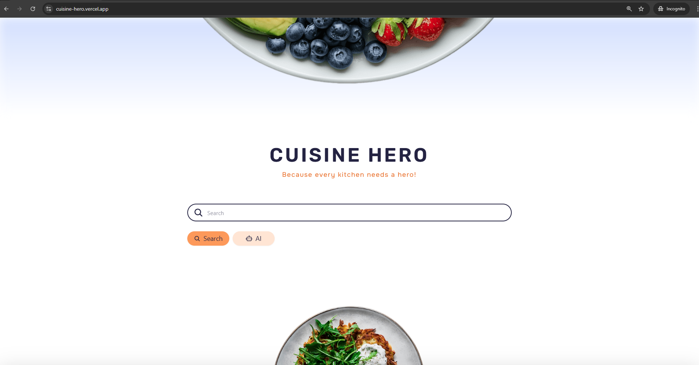
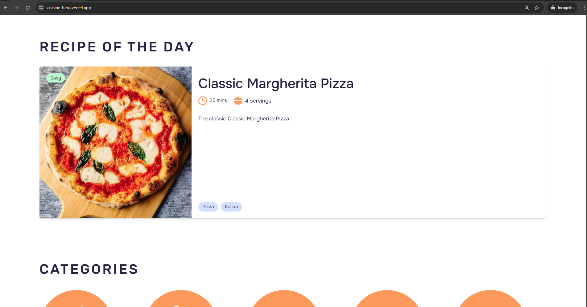
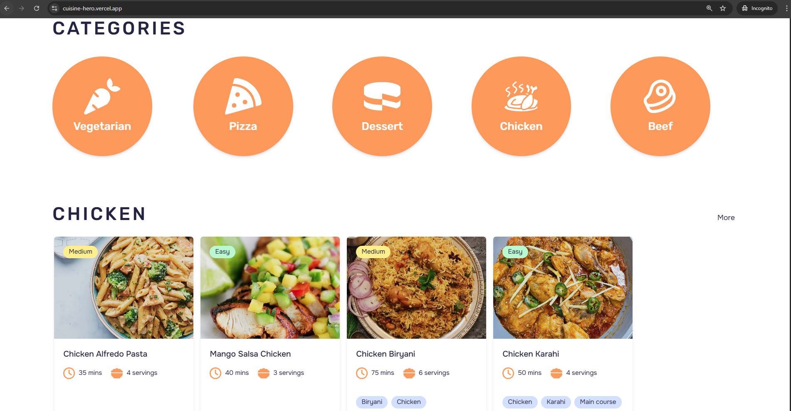
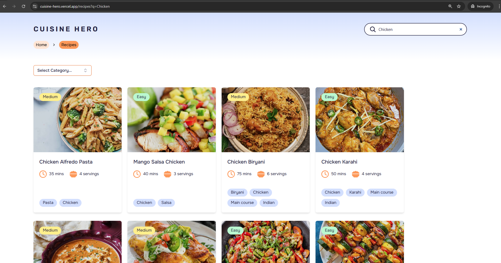
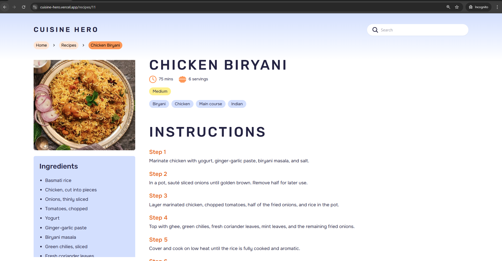
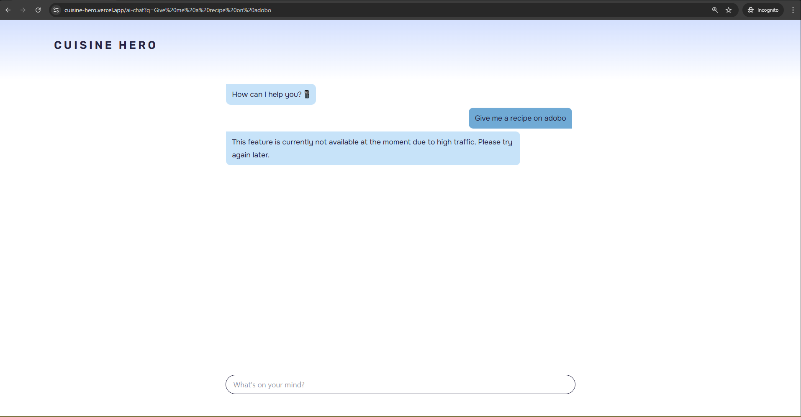

# Cuisine Hero 🍴

Cuisine Hero is a website that provides recipes on different dishes for home cooks, chefs, food enthusiasts, and people alike.

<a href="https://cuisine-hero.vercel.app/"></a>


# Features ⚙️ 
- **Recipe List**
  - Tags
  - Recipe difficulty
  - Total time to cook and prep
  - Servings
- **Recipe details**
  - Instructions
  - Ingredients
- **AI Chatbot integration**
  - An AI Chatbot programmed specifically to answer food related questions
- **Sort recipes by categories**
- **Search recipes**
- **Recipe of the Day**


# Screenshots 📷









# Tools and Technologies 💻
### Tech stack
[](https://skillicons.dev)
### Tools
[](https://skillicons.dev)
### API
</a>


# Getting Started 🚀

### Prerequisites
- Node.js installed
- npm or yarn

### Installation

```bash
# Clone the repository
git clone https://github.com/STI-TakoYucky/Cuisine-Hero.git
cd cuisine-hero

# Install dependencies
npm install

# Run the development server
npm run dev
```


# Areas For Improvement 🔧
- **Recipe list layout fixes (Mobile and Desktop)**
- **Randomized Recipe Logic**
- **Font size fixes**
- **Limited recipes**
- **Limited AI API request**


# Future Features 👨‍🏭
- **Custom API for Recipes**
- **Accounts to upload and save recipes**

# Author 👨‍💼
**Email**: estrada.lnp@gmail.com

**Github**: https://github.com/STI-TakoYucky

**Web Portfolio**: https://lucky-estrada.vercel.app/

